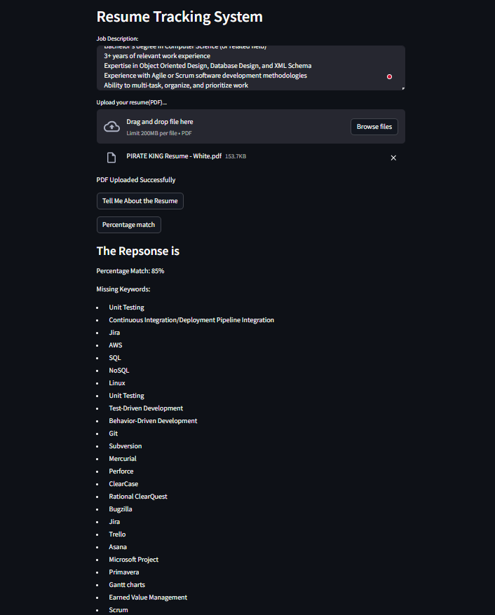
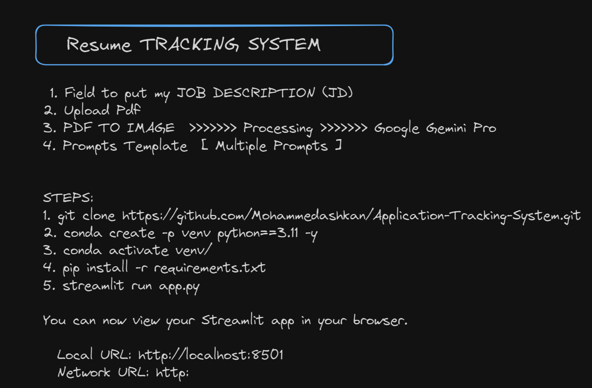

# Resume---Tracking-System
Track Our Possible job using Gemini ai Pro Vision 


```bash
Steps
```

```bash
1. git clone https://github.com/Mohammedashkan/Resume---Tracking-System.git 
``` 

```bash 
2. conda create -p venv python==3.11 -y
```

```bash 
3. conda activate venv/
```


```bash 
4. pip install -r requirements.txt
```

```bash 
5. streamlit run app.py
```

You can now view your Streamlit app in your browser.

  Local URL: http://localhost:8501
  Network URL: http:








